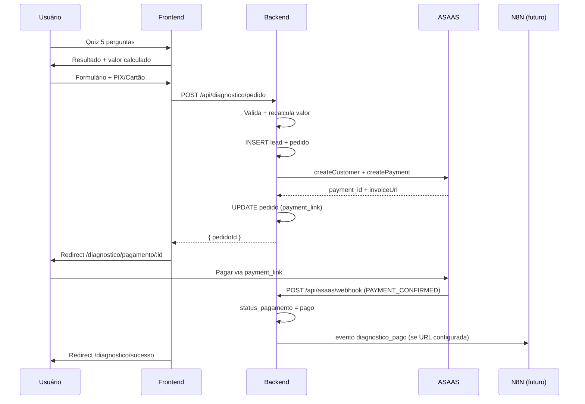

# RELATÓRIO — Sprint 3.11: Diagnóstico Tributário Premium (ASAAS + Pagamento + Entrega)

**Data:** 22/06/2026  
**Objetivo:** Transformar o Diagnóstico Tributário em produto pago com integração ASAAS, mantendo o fluxo existente de leads.

---

## Resumo Executivo

A sprint implementou o funil premium completo: quiz atualizado com precificação automática por regime tributário, criação de pedidos, cobrança via ASAAS (PIX e Cartão), páginas de pagamento e confirmação, webhook de confirmação, dashboard administrativo premium e estrutura preparada para automação N8N (`diagnostico_pago`).

O endpoint legado `POST /api/diagnostico` foi **preservado** para compatibilidade. O novo fluxo premium usa `POST /api/diagnostico/pedido`.

---

## Arquivos Criados

| Arquivo | Descrição |
|---------|-----------|
| `backend/utils/diagnosticoPricing.js` | Mapeamento regime → valor (backend) |
| `backend/utils/inputValidator.js` | Sanitização de e-mail, telefone e strings |
| `backend/services/AsaasService.js` | Integração API ASAAS |
| `backend/services/DiagnosticoPagamentoWebhookService.js` | Webhook interno `diagnostico_pago` (N8N) |
| `backend/controllers/DiagnosticoPedidoController.js` | CRUD pedidos + criação com ASAAS |
| `backend/controllers/AsaasWebhookController.js` | Processamento webhook ASAAS |
| `backend/migrations/008_diagnostico_tributario_pedidos.sql` | Migration PostgreSQL |
| `utils/diagnosticoPricing.ts` | Precificação para exibição no frontend |
| `pages/DiagnosticoPagamento.tsx` | Tela `/diagnostico/pagamento/:id` |
| `pages/DiagnosticoSucesso.tsx` | Tela `/diagnostico/sucesso` |
| `components/DiagnosticoPremiumAdminView.tsx` | Dashboard admin premium |

---

## Arquivos Alterados

| Arquivo | Alteração |
|---------|-----------|
| `pages/DiagnosticoTributario.tsx` | Q1 atualizada, preço exibido, seleção PIX/Cartão, redirect pagamento |
| `backend/database-postgres.js` | Tabela `diagnostico_tributario_pedidos` + colunas em leads |
| `backend/database.js` | Tabelas SQLite equivalentes para dev local |
| `backend/routes/apiRoutes.js` | Novos endpoints públicos e admin |
| `backend/middleware/rateLimiter.js` | Limiters para pedido e webhook ASAAS |
| `App.tsx` | Rotas `/diagnostico/pagamento/:id` e `/diagnostico/sucesso` |
| `pages/Admin.tsx` | Nav "Diag. Premium" + view |
| `backend/.env.example` | Variáveis ASAAS |

---

## Migrations

### Arquivo: `backend/migrations/008_diagnostico_tributario_pedidos.sql`

```bash
psql $DATABASE_URL -f backend/migrations/008_diagnostico_tributario_pedidos.sql
```

**Alterações:**
- `diagnostico_tributario_leads`: colunas `regime_tributario`, `valor`
- Nova tabela `diagnostico_tributario_pedidos` (UUID PK)
- Índices: `lead_id`, `status_pagamento`, `regime_tributario`, `created_at`, `asaas_payment_id`

> Em PostgreSQL, a tabela também é criada automaticamente via `database-postgres.js` no bootstrap.

---

## Endpoints

### Públicos

| Método | Rota | Descrição |
|--------|------|-----------|
| POST | `/api/diagnostico` | Lead legado (preservado) |
| POST | `/api/diagnostico/pedido` | Cria lead + pedido + cobrança ASAAS |
| GET | `/api/diagnostico/pedido/:id` | Consulta pedido (UUID) |
| POST | `/api/asaas/webhook` | Webhook de pagamentos ASAAS |

### Admin (JWT)

| Método | Rota | Descrição |
|--------|------|-----------|
| GET | `/api/admin/diagnostico/pedidos` | Lista pedidos com filtros |
| GET | `/api/admin/diagnostico/pedidos/stats` | Métricas premium |
| GET | `/api/admin/diagnostico/pedidos/export` | Exportação CSV |

---

## Variáveis de Ambiente

### Backend (`backend/.env`)

```env
ASAAS_API_URL=https://sandbox.asaas.com/api/v3   # ou https://api.asaas.com/api/v3
ASAAS_API_KEY=sua_chave_api_asaas
ASAAS_WEBHOOK_TOKEN=token_configurado_no_painel_asaas
```

### Settings (PostgreSQL — tabela `settings`)

| Key | Uso |
|-----|-----|
| `diagnostico_pago_webhook_url` | URL N8N para evento `diagnostico_pago` (futuro) |
| `diagnostico_webhook_url` | Webhook legado de leads (preservado) |

---

## Precificação Automática

| Regime (Q1) | Valor |
|-------------|-------|
| Simples Nacional (`simples_nacional`) | R$ 297,00 |
| Lucro Presumido (`lucro_presumido`) | R$ 797,00 |
| Lucro Real (`lucro_real`) | R$ 597,00 |

- Exibido no frontend após o quiz
- **Recalculado no backend** em `DiagnosticoPedidoController.createPedido`
- Salvo em `diagnostico_tributario_leads.valor` e `diagnostico_tributario_pedidos.valor`

---

## Fluxo Completo



---

## Segurança Implementada

- Validação de e-mail, telefone e nome no backend
- Valor recalculado no servidor (ignora valor do frontend)
- Webhook ASAAS validado via `ASAAS_WEBHOOK_TOKEN`
- Rate limiting: 5 pedidos/min (IP), 60 webhooks/min
- Sanitização de strings de entrada
- UUID do pedido não expõe `asaas_payment_id` na API pública
- Logs estruturados via Winston

---

## Instruções de Deploy

### 1. Banco de dados

```bash
psql $DATABASE_URL -f backend/migrations/008_diagnostico_tributario_pedidos.sql
```

### 2. Variáveis de ambiente

Configure no servidor/Railway/Cloudez:
- `ASAAS_API_URL`
- `ASAAS_API_KEY`
- `ASAAS_WEBHOOK_TOKEN`

### 3. Webhook no painel ASAAS

URL: `https://api.elilonlopesadvogados.com.br/api/asaas/webhook`  
Eventos: `PAYMENT_CREATED`, `PAYMENT_RECEIVED`, `PAYMENT_CONFIRMED`, `PAYMENT_OVERDUE`, `PAYMENT_DELETED`  
Token: mesmo valor de `ASAAS_WEBHOOK_TOKEN`

### 4. Deploy backend + frontend

```bash
# Backend
cd backend && npm install && npm start

# Frontend
npm run build
```

### 5. (Opcional) Automação N8N

Inserir na tabela `settings`:
```sql
INSERT INTO settings (key, value) VALUES ('diagnostico_pago_webhook_url', 'https://seu-n8n/webhook/diagnostico-pago');
```

Payload enviado:
```json
{
  "evento": "diagnostico_pago",
  "timestamp": "ISO-8601",
  "pedido": { ... },
  "lead": { ... },
  "pagamento": { ... }
}
```

---

## Checklist de Testes

### Quiz e Precificação
- [ ] Q1 exibe 3 opções (sem "Não sei ao certo")
- [ ] Simples Nacional → R$ 297,00 exibido após quiz
- [ ] Lucro Presumido → R$ 797,00
- [ ] Lucro Real → R$ 597,00

### Formulário e Pedido
- [ ] Validação de e-mail inválido retorna erro amigável
- [ ] WhatsApp inválido retorna erro
- [ ] Seleção PIX gera cobrança PIX no ASAAS
- [ ] Seleção Cartão gera cobrança CREDIT_CARD
- [ ] Redirect para `/diagnostico/pagamento/:id`

### Pagamento
- [ ] Página exibe resumo (nome, empresa, valor, método, status)
- [ ] Botão "Pagar Agora" abre `payment_link`
- [ ] Polling detecta pagamento confirmado
- [ ] Redirect automático para `/diagnostico/sucesso`

### Webhook ASAAS
- [ ] Token inválido retorna 401
- [ ] `PAYMENT_CONFIRMED` atualiza status para `pago`
- [ ] `paid_at` preenchido
- [ ] Lead marcado como `convertido`

### Admin
- [ ] View "Diag. Premium" acessível em `/admin`
- [ ] Cards de métricas carregam
- [ ] Filtros por status, regime e período funcionam
- [ ] Exportação CSV baixa arquivo

### Segurança
- [ ] Rate limit após 5 pedidos/min retorna 429
- [ ] Valor manipulado no frontend é ignorado (backend recalcula)
- [ ] Endpoint legado `POST /api/diagnostico` continua funcionando

### UX
- [ ] Loading states durante submit
- [ ] Retry automático em falhas temporárias
- [ ] Skeleton na página de pagamento
- [ ] Touch targets ≥ 44px em mobile

---

## Observações

1. **Sandbox ASAAS:** Use `https://sandbox.asaas.com/api/v3` para testes.
2. **Endpoint legado:** Leads gratuitos via `POST /api/diagnostico` permanecem disponíveis.
3. **SQLite local:** Tabelas adicionadas em `database.js` para dev; produção usa PostgreSQL.
4. **Chat/N8N:** Integração conversacional existente não foi alterada.
